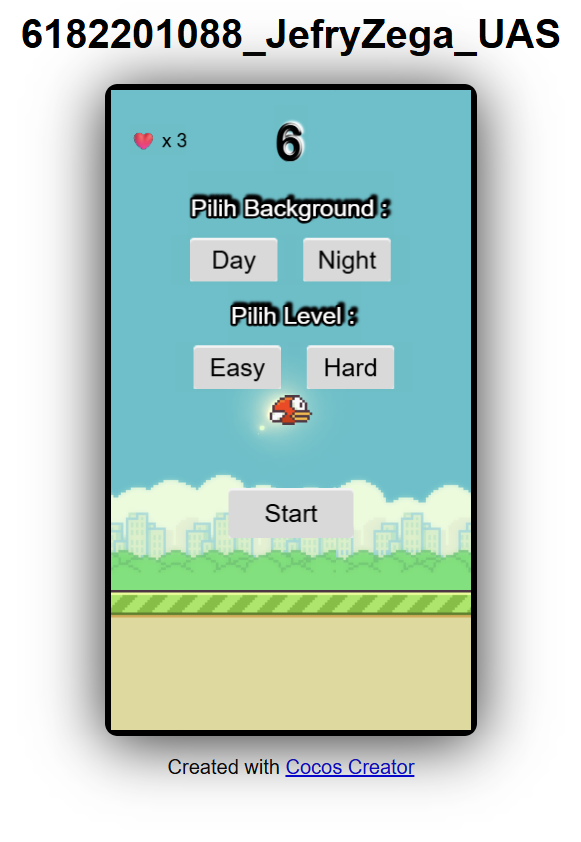
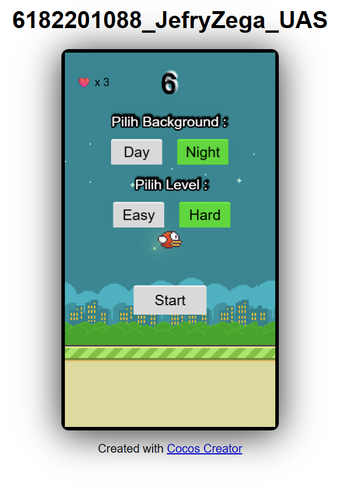
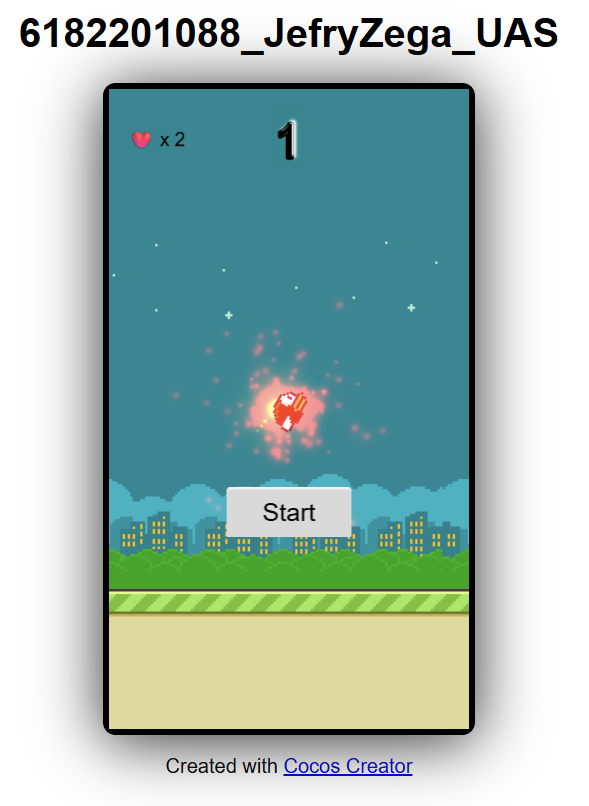

# 🐤 Flappy Birds - Proyek UAS Dasar Pemrograman Games

LINK UNTUK TEST GAME
https://6182201088-jefryzega-uas.netlify.app

> Game buatan **Jefry Krisman Jaya Zega**  
> NPM: `6182201088`  
> [🎮 Cek Repository GitHub](https://github.com/JefryZega/6182201088-JEFRYZEGA-UAS)

---

--

## 🎯 Deskripsi Singkat

Flappy Birds adalah game side-scrolling bergaya Flappy Bird klasik yang dibuat dengan **Cocos Creator + TypeScript**. Game ini dikembangkan dalam satu scene interaktif, dengan fitur lengkap berdasarkan soal-soal UAS yang diberikan.

## 📌 Catatan Penting
Repository ini merupakan versi final dan lengkap dari project Flappy Birds saya.
Beberapa repository sebelumnya adalah versi pengembangan/tahapan awal.
Silakan gunakan repository ini untuk melihat hasil akhir dari seluruh implementasi fitur sesuai soal UAS

---

## ✅ Fitur Sesuai Soal UAS

| Soal | Fitur                                                                 | Status |
|------|-----------------------------------------------------------------------|--------|
| 2    | Partikel ledakan saat karakter mati                                   | ✅ DONE |
| 4    | Pemilihan background di awal permainan                                | ✅ DONE |
| 5    | Halaman result dengan score & best score (save data)                  | ❌ BELUM |
| 11   | Health system: karakter punya 3 nyawa dengan tampilan visual          | ✅ DONE |
| 12   | Partikel muncul saat nabrak pipa/tanah/langit                         | ✅ DONE |
| 13   | Mode easy dan hard (kecepatan background dan pipa berbeda)            | ✅ DONE |
| 14   | Special item untuk multiplier score                                   | ❌ BELUM |
| 17   | Animasi karakter aktif di semua kondisi (idle, main, mati)            | ✅ DONE |
| 22   | 5 detik awal: karakter tidak bisa mati (invincible)                   | ✅ DONE |
| 25   | Efek fade putih saat game over (kejeduk pipa)                         | ✅ DONE |

---

## 🎮 Cara Main

1. Pilih background (Siang atau Malam)
2. Pilih level (Easy atau Hard)
3. Klik tombol Start
4. Tap untuk terbang dan hindari pipa
5. Saat nabrak, nyawa berkurang. Game hanya restart saat nyawa habis
6. Kumpulkan skor sebanyak mungkin dan kalahkan best score!

---

## 🧪 Fitur Utama (Detail)

- 🎨 Pemilihan background sebelum bermain
- 💣 Partikel ledakan saat nabrak
- ⚙️ Dua mode permainan: Easy (normal) & Hard (cepat)
- ❤️ Health system: 3 nyawa, bisa main ulang tanpa reset scene
- ⏱️ Invincibility 5 detik pertama
- 🎞️ Animasi burung idle, kepak saat main, dan efek mati
- 🥇 Penyimpanan skor terbaik (`localStorage`)
- 🌈 Efek visual tambahan: fade putih saat game over

---

## 🛠️ Teknologi yang Digunakan

- 🎮 [Cocos Creator 3.x](https://www.cocos.com/en/creator)
- 🧠 Bahasa: TypeScript
- 💾 Penyimpanan lokal: `localStorage`
- 🎨 SpriteFrame Management, Animation, UI System, Particle Effect

---
